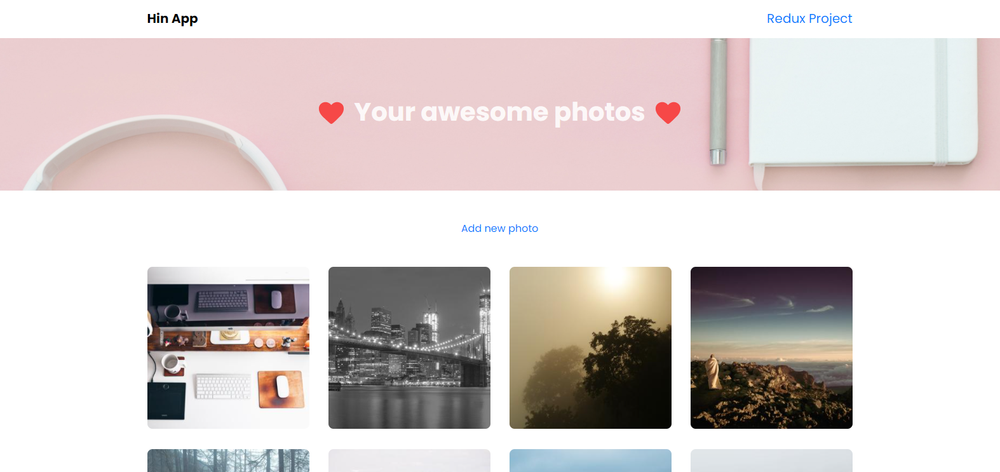

# Mini Project: Photo App



## Setup environment

### 1. Setup ReactJS App using Create React App

> Link: https://create-react-app.dev/docs/getting-started/

### 2. Add SCSS support

```js
npm i --save-dev node-sass
```

### 3. Add react router

```
npm i --save react-router-dom
```

### 4. Add UI lib

```
npm i --save reactstrap
```

## Folder structure

```
src
|__ assets
|  |__ images
|  |__ styles (global styles)
|
|__ components (shared components)
|
|__ features
  |__ Photo
    |__ components
    |  |__ PhotoList
    |  |__ PhotoCard
    |  |__ PhotoForm
    |
    |__ pages
    |  |__ MainPage
    |  |__ AddEditPage
    |__ photoSlice.js
    |__ index.js
```

## Organize Routing

- Using lazy load technique.
- Load depend on features.

```js
// App.js
function App() {
  return (
    <BrowserRouter>
      <Switch>
        <Route path="/photos" component={Photo} />
        <Route path="/user" component={User} />
        <Route component={NotFound} />
      </Switch>
    </BrowserRouter>
  );
}
```

## Custom Field

- Bridge between UI control and Formik.
- UI control is a controlled component with props:
  - name: defined the control
  - value: the value of control
  - onChange: trigger when the value change
  - onBlur: determine when this control is touched

```js
function InputField(props) {
  const { field, type, label, placeholder, disabled } = props;
  const { name } = field;

  return (
    <FormGroup>
      {label && <Label for={name}>{label}</Label>}

      <Input id={name} {...field} type={type} disabled={disabled} placeholder={placeholder} />
    </FormGroup>
  );
}
```

## Random Photo control

RandomPhoto
Props

- name
- imageUrl
- onImageUrlChange
- onRandomButtonBlur
